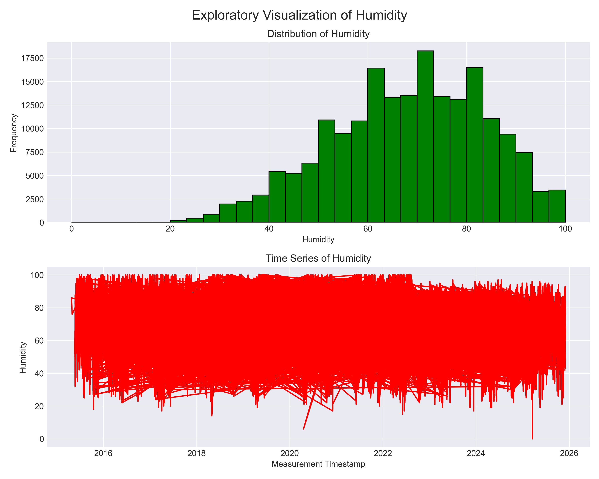
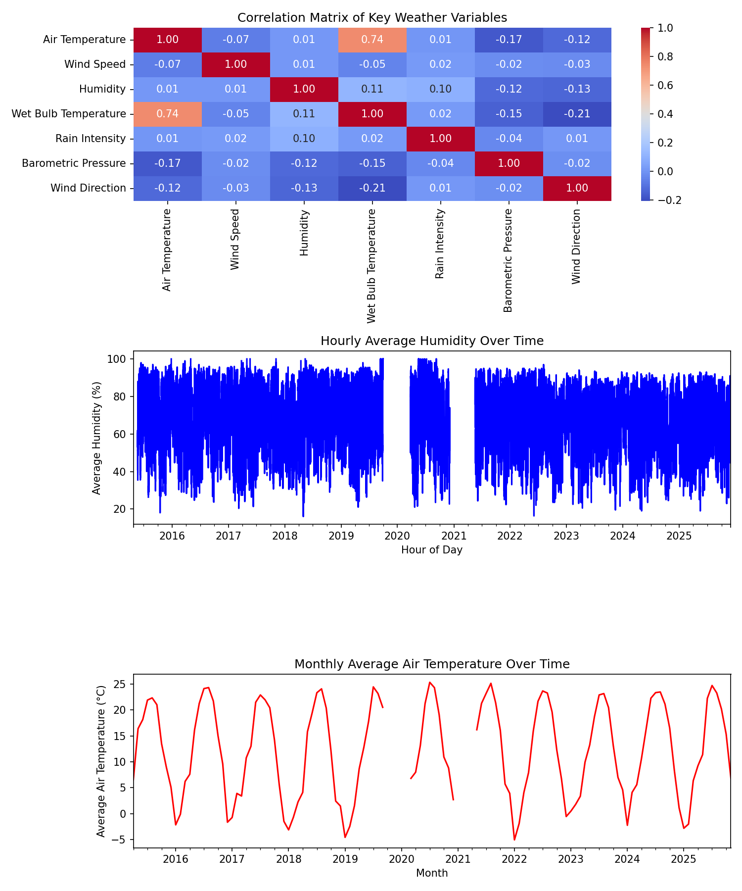
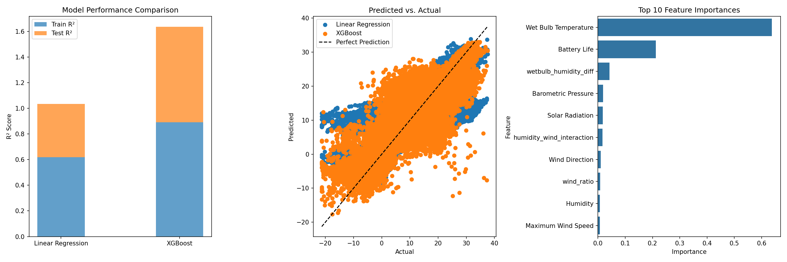

# Chicago Beach Weather Sensors Analysis 

## Executive summary 
In this analysis we examine the weather sensor data from Chicago beaches containing 196,194 data collected hourly from April 2015 to November 2025 over a span of three different stations. This projects consists of a total of 9 phases. Phases 1-3 are mostly responsible for data exploring, cleaning and wrangling. Phases 4-6 prepares the dataset for modeling. Phases 7-8 models the data which allows us to interpret the results. The workflow allows us to better understand the temportal patterns and build predictive models for air temperature. From the predictive models, XGBoost outperformed the other models with a test R² of 0.7441, test RMSE of 5.0905, and test MAE of 3.2852. 

## Phase by Phase Findings 
---
### Phase 1 Exploration 
The initial exploration revealed a dataset containing 196,194 rows with 18 columns. Columns included `Station Name`, `Measurement Timestamp`, `Air Temperature`, `Wet Bulb Temperature`, `Humidity`, `Rain Intensity`, `Interval Rain`, `Total Rain`, `Precipitation Type`, `Wind Direction`, `Wind Speed`, `Maximum Wind Speed`, `Barometric Pressure`, `Solar Radiation`, `Heading`, `Battery Life`, `Measurement Timestamp Label`, and `Measurement ID`. The measurements are taken from three different weather stations: 63rd Street Weather Station, Foster Weather Station, and Oak Street Weather Station. 

#### Key Data Quality Issues Identified 
- There are approximately 75 missing values for Air Temperature 
- Missing values for Wet Bulb Temperature, Rain Intensity, Total Rain, Precipitation Type, and Heading are all the same (75,887 each).
- There are approximately 146 missing values for Barometric Pressure 
- There are some outliers in Battery Life 

#### Initial Visualization Showed 
The graph on the left shows the distribution plot of Air Temperature. The mean is around 12.63 with a maximum of 37.6 and a minimum of -29.78. The graph on the right shows a time series plot with Air Temperature. So far, it is hard to tell if there is a specific pattern. 

---

### Phase 2: Data Cleaning
The data cleaning phase addressed issues regarding missing values, outliers, duplicates, and data type conversions. Impossible values were removed first. For example, humidity levels were given a range of 0-100. Rain intensity, total rain, interval rain, wind speed, maximum wind speed, and solar radiation can not be negative. Wing direction and heading were given a range of 0-360. Once impossible values were removed, numeric variables were filled using the median. Even though precipitation type is numeric, the way the data was entered made it seem more categorical so I made it into a category. Missing values in precipitation types was filled using the mode. Measurement timestamp was filled using both forward fill and backward fill. Object columns were will with "unknown."

#### Cleaining Results 
- Rows before cleaning: 196,194
- Missing values: Forward filled, backward filled, median-imputed,   mode-imputed 
    - `Air Temperature`: 75 missing -> 0 missing 
    - `Wet bulb temperature`, `Rain Intensity`, `Total Rain`, `Precipitation Type`, `Heading`: 75887 missing -> 0 missing 
    - Barometric Pressure: 146 missing -> 0 missing 
- Outliers: Detected 6 outliers in Battery Life using IQR method 
- Duplicates: Removed (0 duplicates found)
- Data types: Validated and converted as needed 
    - Converted precipitation type to category for better handling 
- Rows after cleaning: 182,768

The cleaning process removed 13,426 rows. Most of the values removed were from solar radiation using a range due to the extreme negative values. However, the numeric variables and measurement timestamp were imputed, maintaining the overall data size. 

---

### Phase 3: Data Wrangling 
In order to perform time series analysis, datetime parsing and temportal feature extraction is necessary. The `Measurement Timestamp` column was parsed from the format "MM/DD/YYYY HH:MM:SS AM/PM" and set as the DataFrame index. 

#### Temporal Features Extracted:
- `hour`: Hour of day (integer, 0-23)
- `day_of_week`: Day of week (integer, 0 = Monday, 6 = Sunday)
- `month`: Month of year (integer, 1-12)
- `year`: Year 
- `day_name`: Day name (string, Monday - Sunday)
- `is_weekend`: Binary indicator (integer, 1 if Saturday/Sunday)

The dataset covers from April 2015 - November 2025 (approximately 10 years)

---

### Phase 4: Feature Engineering 
In this phase, derived features and rolling statistics were used to examine the relationships and temporal dependencies. 

#### Derived Features 
- `wetbulb_humidity_diff`
- `wind_ratio`
- `humidity_wind_interaction`
- `wind_speed_squared`

#### Rolling Window Features 
- `interval_raining_rolling_7h`
- `wind_speed_rolling_24h`

Features that involve the target variable were not created to avoid data leakage. 

---

### Phase 5: Pattern Analysis 
This phase revealed important patterns and correlations between variables. 

#### Temporal Trends:
- Monthly average air temperature shows a clear seasonal pattern
- Higher temperatures in summer months (June-August)
- Lower temperatures in winter months (December-February)
- Monthly air temperature ranges from approximately -2.54°C to 23.55°C

#### Daily patterns:
- Average humidity remains relatively stable across days of the week
- Slightly higher humidity on Wednesdays and Fridays 
- Average humidity ranges from approximately 67.23% to 68.82%

#### Correlations:
- Strong positive correlation between air temperature and wet bulb temperature (corr = 0.72)
- Moderate negative correlation between air temperature and wind speed (corr = -0.19)

---

### Phase 6: Modeling Preparation
A target variable was selected and temporal train/test splitting was perfomed. For this project, air temperature is the target variable. 

#### Temporal Train/Test Split 
- Split method: Temporal(80/20 split by time, not random)
- Training set size: 146,213 samples
- Test set size: 36,555 samples 
- Rationale: Random split was not used because time series data has temporal dependencies. Using future data to predict the past could result in data leakage. 

#### Feature Preparation:
- Converted precipitation type to a category 
- Dropped Measurement Timestamp, Measurement ID, and Measurement Timestamp Label because they are not useful in the prediction 
- Dropped Air Temperature for X_test and X_train because it is the target variable
- Total dataset: 196,194 before split 

---

### Phase 7: Modeling
For this phase, two models were trained and evaluated: Linear Regression and XGBoost. 

#### Model Performance:

| Model | R² Score | RMSE | MAE |
|-------|----------|------|-----|
| Linear Regression | 0.4154 | 7.6939 | 5.7413 |
| XGBoost | 0.7441 | 5.0905 | 3.2852 |

#### Key Findings:
- Linear Regression achieved moderate performace (R² = 0.4154). This model alone is not sufficient enough to predict air temperature
- XGBoost achieved a high performance (R² = 0.7441). This model alone is sufficient to predict air temperature
- XGBoost outperforms Linear Regression, with RMSE of 5.0905°C compared to 7.6939°C 

#### Feature Importance
- Wet Bulb Temperature (importance = 0.64)
- Battery Life (importance = 0.21)
- wetbulb_humidity_diff (importance = 0.04)

The wet bulb temperature feature accounts for 64% of total importance. This makes sense because they are equal at 100% humidity. 

---

### Phase 8: Results
The final results show a decent of prediction of air temperature with accuracy. The XGBoost model achieved high performance on the test set with predictions within 5.0905°C. 

#### Summary of Key Findings:
1. **Model Performance:** XGBoost achieves R² = 0.7441, indicating that 74.41 of the variance in air temperature can be explained by the features
2. **Feature Importance:** The wet bulb temperature is the most important predictor (64%)
3. **Temporal Patterns:** There were strong seasonal patterns for air temperature
4. **Data Quality:** The cleaning process removed some rows but retained more than 50% of the data
5. **Data Leakage Avoidance:** In order to avoid data leakage, we avoided created derived and rolling features that included the target variable

The XGBoost achieved an overall higher performance. The predicted vs. actual graph shows a scatter plot distributed around the perfect prediction line. There is some points that are scattered outside the line, but this is normal since there may be some extreme values when it comes to air temperature/weather prediction. 

--- 

### Visualizations 

---

---

### Model Results
The modeling phase built predictive models for air temperature. The model shows that XGBoost outperforms Linear Regression. 

#### Performance Interpretation
- **R² Score:** The R² value measures the proportion of variance in a dependent variable. The XGBoost R² value is 0.7441. This means that 74.41% of the variation in air temperature can be explained by the model.
- **RMSE (Root Mean Squared Error):** The RMSE value measures the average magnitude of the difference between the actual and predicted vales. XGBoost's RMSE value (5.0905°C) is lower than the RMSE value for linear regression (7.6939°C).
- **MAE (Mean Absolute Error):** The MAE value measures the average magnitude of errors. XGBoost's MAE value (3.2852°C) is considered average. 

#### Model Selection: XGBoost was selected as the best model 
1. Highest R² score (0.7441)
2. Lowest RMSE (5.0905°C)
3. Lowest MAE (3.2852°C)

#### Feature Importance Insights: The feature importance reveals that:
- Wet bulb temperature is the most important predictor (0.64)

---

### Time Series Patterns 
The analysis revealed important temporal patterns:

#### Long-term trends:
- The data seems stable besides the fact that there are some changes in between seasons 

#### Seasonal Patterns:
- **Monthly:** Monthly average air temperature shows a clear seasonal pattern, higher temperatures in summer months (June-August), lower temperatures in winter months (December-February)
- **Daily:** Daily humidity levels remained constant except for slightly higher humidity on Wednesday and Friday

#### Temporal Relationships 
- Air temperature varies by seasons
- Air temperature has a negative correlation with wind speed (-0.19)
- Wet bulb temperature has a moderate positive correlation with Total rain (0.55)

### Limitations and Next Steps
1. **Data Quality:**
    - Very large dataset with many missing values, this can introduce bias
    - The number of weather stations was limited, prevents generatlization
2. **Model Limitations:** 
    - Linear regression models usually assumes linear relationships, which may not fully capture everything since weather data can contain more extreme values
    - XGBoost model can sometimes cause overfitting
3. **Feature Engineering:**
    - There were limited temporal featurs
    - Some variables may seem highly correlated such as total rain and interval rain
4. **Scope:**
    - The data comes from a limited number of weather stations
    - The model only predicts one variable

---

### Next Steps:
1. **Data Improvement:**
    - Gather information from more weather stations, allow for generalization
    - Include other different variables that are less similar to each other (total rain, interval rain)
2. **Model Improvements:**
    - Try additional models such as Random Forest 
    - Can maybe try to implement stacking

--- 

### Conclusion
This project consisted 9-phase workflow that cleaned and analyzed the Chicago Beach Weather Sensors Data. Methods such as imputation and the IQR method was used to handle missing values and outliers. The plots showed temporal relationships for air temperature. From there we could see that air temperature varied by seasons. The models achieved good air temperature predictors with R² value of 0.7441 and RMSE value of 5.0905°C. Data leakage was prevented by avoiding creating derived features and rolling statistics that included the target variable. 

